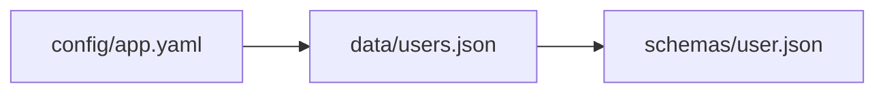

```
 ____                  __  __             
|  _ \ ___ _ __   ___ |  \/  | __ _ _ __  
| |_) / _ \ '_ \ / _ \| |\/| |/ _` | '_ \ 
|  _ <  __/ |_) | (_) | |  | | (_| | |_) |
|_| \_\___| .__/ \___/|_|  |_|\__,_| .__/ 
          |_|                      |_|    
```

A Python CLI and library that scans repositories for cross-file references in YAML, JSON, and other configuration files, building a dependency graph that can be exported in multiple formats.

## Features

- **File Discovery**: Recursively scan directories for configuration files (YAML, JSON, TOML)
- **Reference Detection**: Automatically detect file path references in configuration files
- **Smart Filtering**: By default, only shows files that are connected to other files (via references, missing refs, or URLs) - keeping output clean in large repositories
- **Multiple Export Formats**:
  - **ASCII** (default): Tree-style output for terminal display, scripting, and CI pipelines
  - **Mermaid**: Flowchart syntax for visualization and documentation
  - **JSON**: Machine-readable format for automation and integration

## Installation

```bash
# Clone the repository
git clone https://github.com/SamPlaysKeys/Repository-Mapper.git
cd Repository-Mapper

# Option 1: Install as a package (recommended)
pip install -e .

# Option 2: Install dependencies only (run via python cli.py)
pip install -r requirements.txt
```

## Usage

After installing as a package (`pip install -e .`), use the `repomap` command. If you only installed dependencies, use `python cli.py` instead.

### Basic Usage

```bash
# Scan current directory, output ASCII tree
repomap .
# or: python cli.py .

# Scan a specific directory
repomap ./config

# Output to a file
repomap . -o graph.txt
```

### Output Formats

#### ASCII Tree (Default)

```bash
repomap . -f ascii
```

Output:
```
config/app.yaml
├── data/users.json
│   └── schemas/user.json
└── config/local.yaml
    └── data/users.json [*]
```

The `[*]` marker indicates a node that was already visited (cycle detection).

Use `--ascii-style=ascii` for pure ASCII output (no Unicode characters):

```bash
repomap . -f ascii --ascii-style=ascii
```

Output:
```
config/app.yaml
|-- data/users.json
|   \-- schemas/user.json
\-- config/local.yaml
    \-- data/users.json [*]
```

#### Mermaid Flowchart

```bash
repomap . -f mermaid
```

Output:


Options:
- `--orientation`: Set flowchart direction (LR, TD, TB, RL, BT)
- `--group-by-dir`: Group nodes by top-level directory using subgraphs

#### JSON

```bash
repomap . -f json
```

Output:
```json
{
  "nodes": ["config/app.yaml", "data/users.json", "schemas/user.json"],
  "edges": [["config/app.yaml", "data/users.json"], ["data/users.json", "schemas/user.json"]]
}
```

### Scanning Options

```bash
# Only scan YAML files
repomap . --include-ext .yaml .yml

# Exclude additional directories
repomap . --exclude-dir vendor third_party

# Limit scan depth
repomap . --max-depth 3

# Change base path for relative path display
repomap ./project/config --relative-to ./project

# Hide unresolved file references from output
repomap . --ignore-missing

# Hide remote (URL) references from output
repomap . --ignore-remote

# Show all files, including those with no connections
repomap . --show-all

# Hide template paths (Jinja {{ }} placeholders)
repomap . --ignore-templates
```

### Filtering Behavior

By default, RepoMap only displays files that have connections:
- Files that reference other files
- Files that are referenced by other files
- Files with unresolved (missing) references
- Files with remote URL references
- Files with template references (unless `--ignore-templates` is used)

This keeps output manageable in large repositories. Use `--show-all` to include all scanned files, even those with no connections.

### Template Paths

RepoMap automatically detects Jinja-style template paths (containing `{{ }}` placeholders). These are paths that will be resolved at runtime, such as:

```yaml
config_path: "config/{{ env }}/settings.yaml"
```

By default, template paths are **shown** in output with a `[TEMPLATE]` label:

```
config/app.yaml
├── data/users.json
└── config/{{ env }}/settings.yaml [TEMPLATE]
```

Use `--ignore-templates` to hide them from output:

```bash
repomap . --ignore-templates
```

Template paths are tracked separately from missing references - they are not marked as `[MISSING]` since their unresolved state is intentional.

### Full CLI Reference

```
usage: repomap [-h] [-o OUTPUT] [-f {ascii,mermaid,json}]
               [--orientation {LR,TD,TB,RL,BT}] [--group-by-dir]
               [--ascii-style {tree,ascii}] [--include-ext INCLUDE_EXT [INCLUDE_EXT ...]]
               [--exclude-dir EXCLUDE_DIR [EXCLUDE_DIR ...]] [--max-depth MAX_DEPTH]
               [--relative-to RELATIVE_TO] [--ignore-missing] [--ignore-remote]
               [--show-all]
               [--ignore-templates]
               [root]

Scan a repository for cross-file references and generate dependency graphs.

positional arguments:
  root                  Repository root directory (default: current directory)

options:
  -h, --help            show this help message and exit
  -o OUTPUT, --output OUTPUT
                        Output file (default: stdout)
  -f {ascii,mermaid,json}, --format {ascii,mermaid,json}
                        Output format (default: ascii)
  --orientation {LR,TD,TB,RL,BT}
                        Mermaid flowchart orientation (default: LR)
  --group-by-dir        Group nodes by top-level directory in Mermaid output
  --ascii-style {tree,ascii}
                        ASCII output style: 'tree' (Unicode) or 'ascii' (pure ASCII)
  --include-ext INCLUDE_EXT [INCLUDE_EXT ...]
                        File extensions to include (e.g., .yaml .json)
  --exclude-dir EXCLUDE_DIR [EXCLUDE_DIR ...]
                        Directory names to exclude
  --max-depth MAX_DEPTH
                        Maximum directory depth to scan
  --relative-to RELATIVE_TO
                        Base path for relative path display
  --ignore-missing      Hide missing (unresolved) file references from output
  --ignore-remote       Hide remote (URL) references from output
  --show-all            Include nodes that have no connections (by default,
                        only connected nodes are shown)
  --ignore-templates    Hide template paths (paths containing Jinja {{ }}
                        placeholders)
```

## Library Usage

```python
from pathlib import Path
from scanner import build_graph
from exporters import to_ascii, to_mermaid, to_json

# Build the reference graph
graph = build_graph(
    root=Path("./my-repo"),
    include_ext={".yaml", ".json"},
    max_depth=5,
)

# Export to different formats (by default, only connected nodes are shown)
ascii_output = to_ascii(graph, root=Path("./my-repo"))
mermaid_output = to_mermaid(graph, root=Path("./my-repo"), orientation="TD")
json_output = to_json(graph, root=Path("./my-repo"))

# Include all nodes, even those with no connections
ascii_all = to_ascii(graph, root=Path("./my-repo"), show_all=True)

# Include template paths in output
ascii_with_templates = to_ascii(graph, root=Path("./my-repo"), include_templates=True)

# Work with the graph directly
print(f"Found {len(graph)} files")
print(f"Connected files: {len(graph.get_connected_nodes())}")
print(f"Root files: {graph.get_roots()}")

for source, target in graph.iter_edges():
    print(f"{source} -> {target}")

# Iterate over template references
for source, template_path in graph.iter_templates():
    print(f"{source} -> {template_path} [TEMPLATE]")
```

## UX Expectations for Automation

### ASCII Format (`--format=ascii`)

- **Deterministic**: Same input produces same output order
- **Stable**: Suitable for diffing in CI pipelines
- **Human-readable**: Easy to scan visually

### Mermaid Format (`--format=mermaid`)

- **Visualization**: Copy output into Mermaid-compatible tools
- **Documentation**: Embed in Markdown files with ```mermaid code blocks
- **Interactive**: Use with Mermaid Live Editor for exploration

### JSON Format (`--format=json`)

- **Machine-readable**: Easy to parse programmatically
- **Integration**: Feed into other tools or scripts
- **Automation**: Use in CI/CD pipelines for analysis

## Development

### Running Tests

```bash
# Install with dev dependencies
pip install -e ".[dev]"

# Run tests
pytest tests/ -v

# Run with coverage
pytest tests/ --cov=. --cov-report=html
```

### Project Structure

```
repository-mapper/
├── cli.py              # CLI entry point
├── graph/
│   ├── __init__.py
│   └── model.py        # ReferenceGraph data model
├── scanner/
│   ├── __init__.py
│   ├── discovery.py    # File discovery
│   ├── parser.py       # File parsing and path extraction
│   ├── resolver.py     # Path resolution
│   └── builder.py      # Graph builder
├── exporters/
│   ├── __init__.py
│   ├── ascii_exporter.py
│   ├── mermaid_exporter.py
│   └── json_exporter.py
├── tests/
│   ├── test_graph.py
│   ├── test_exporters.py
│   └── test_scanner.py
├── requirements.txt
└── README.md
```

## Acknowledgments

This project was developed with the assistance of AI coding tools. AI was used to help write code, add references, and generate documentation comments throughout the project.

## License

This file is part of Repository Mapper.

Repository Mapper is free software: you can redistribute it and/or modify it under the terms of the GNU General Public License as published by the Free Software Foundation, either version 3 of the License, or (at your option) any later version.

Repository Mapper is distributed in the hope that it will be useful, but WITHOUT ANY WARRANTY; without even the implied warranty of MERCHANTABILITY or FITNESS FOR A PARTICULAR PURPOSE. See the GNU General Public License for more details.

You should have received a copy of the GNU General Public License along with Repository Mapper. If not, see <https://www.gnu.org/licenses/>. 
